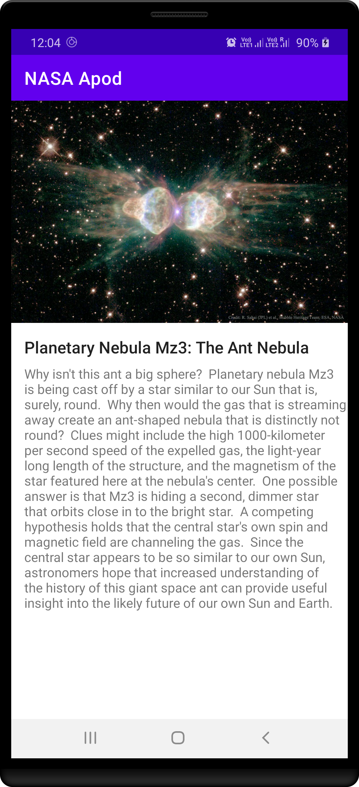
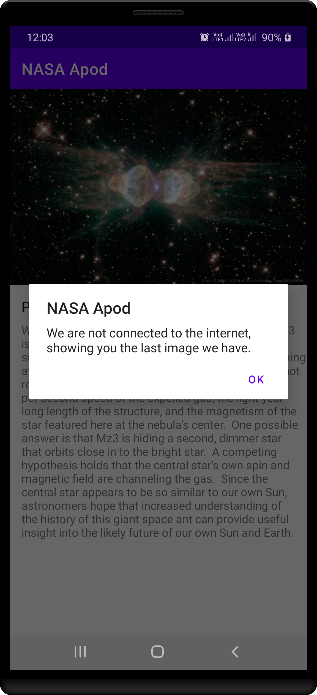

# NASA-APOD

# Notes  
* Used MVVM architecture with kotlin.
* Used Retrofit library to fetch the apod image and stored in Room DB for offline access.
* Story implementation meets the acceptance criteria.
* The UI is kept simple meeting the story expectations.
* APK can be downloaded at [APK](app-release.apk)

# Screenshots
   

